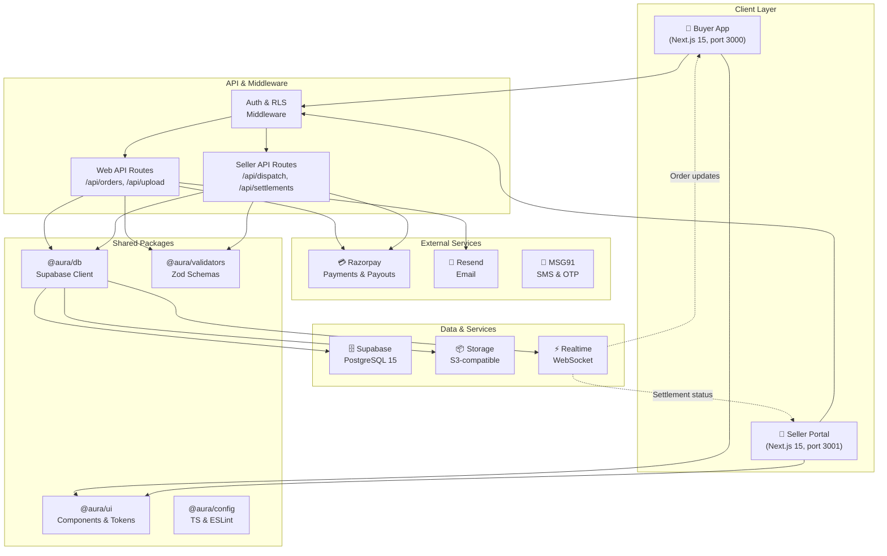
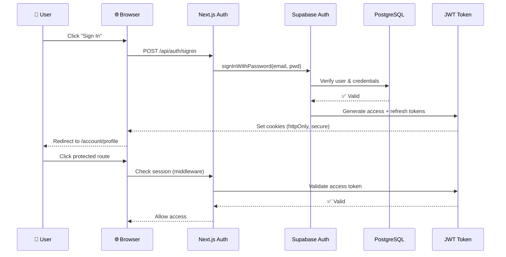
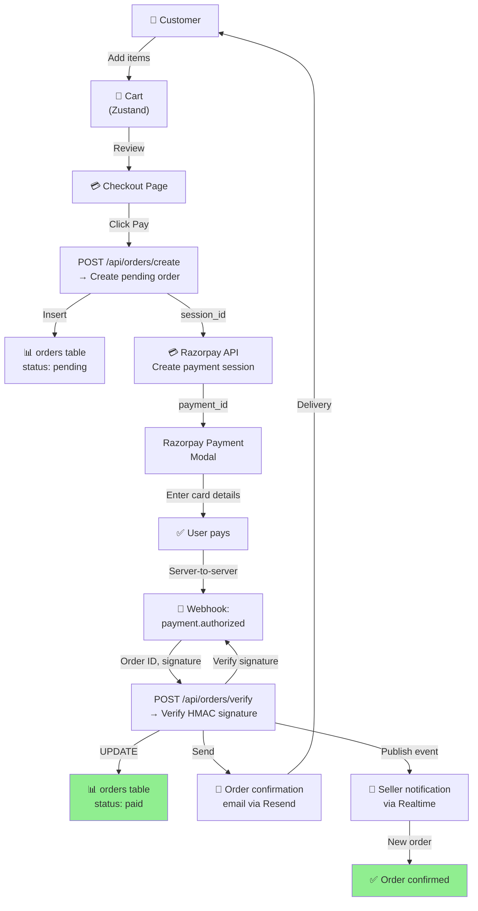
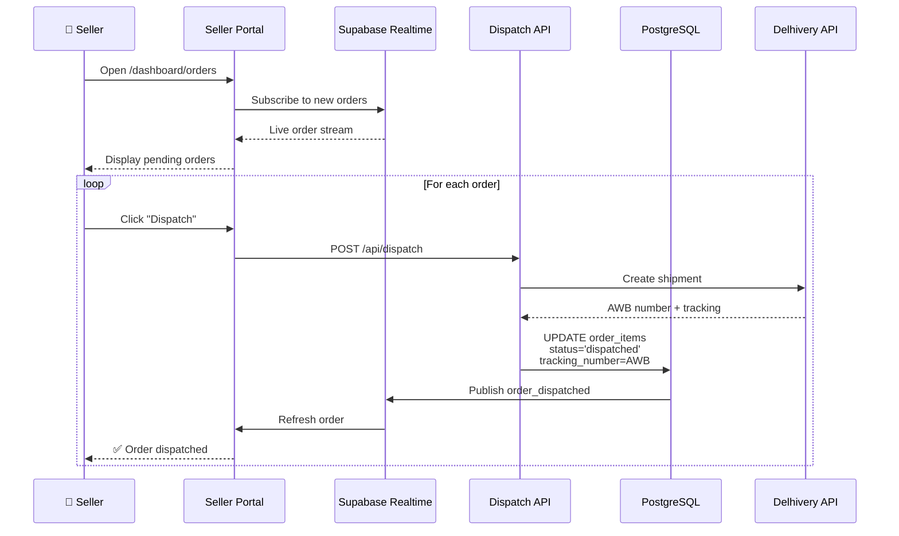
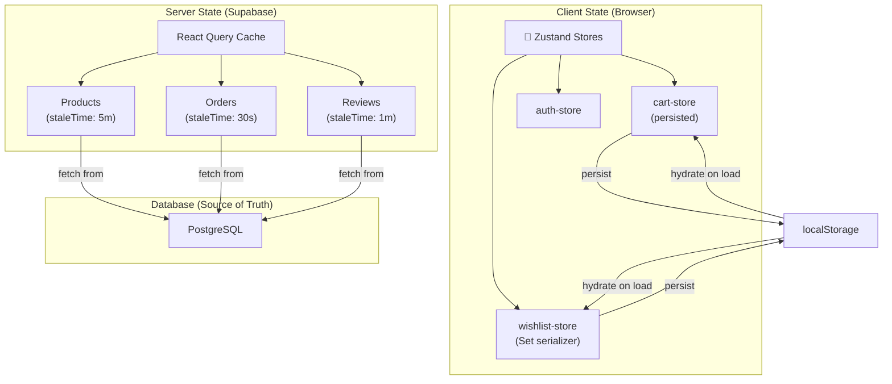
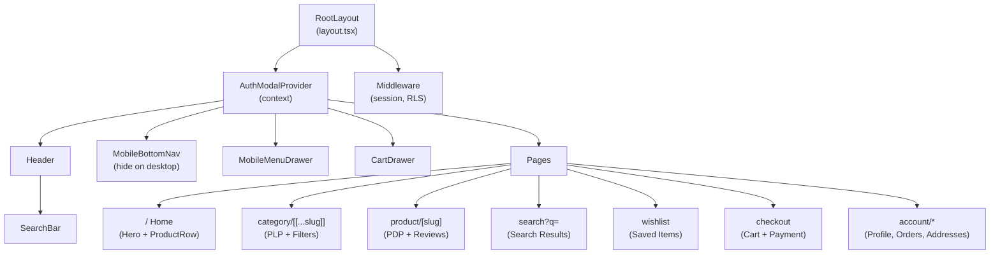
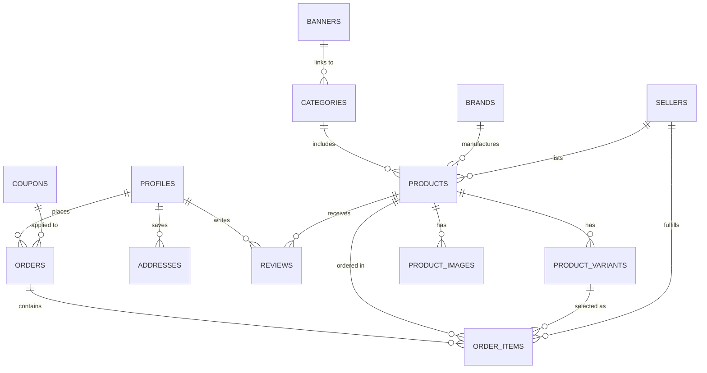
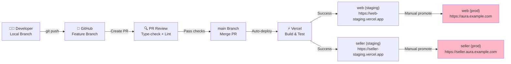
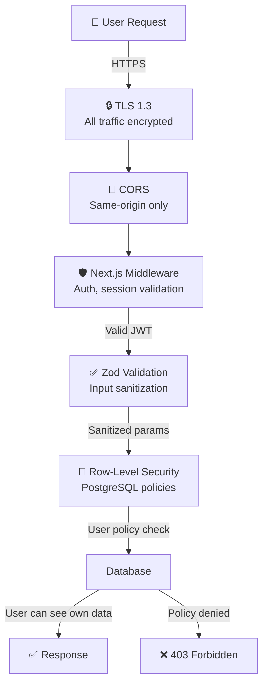
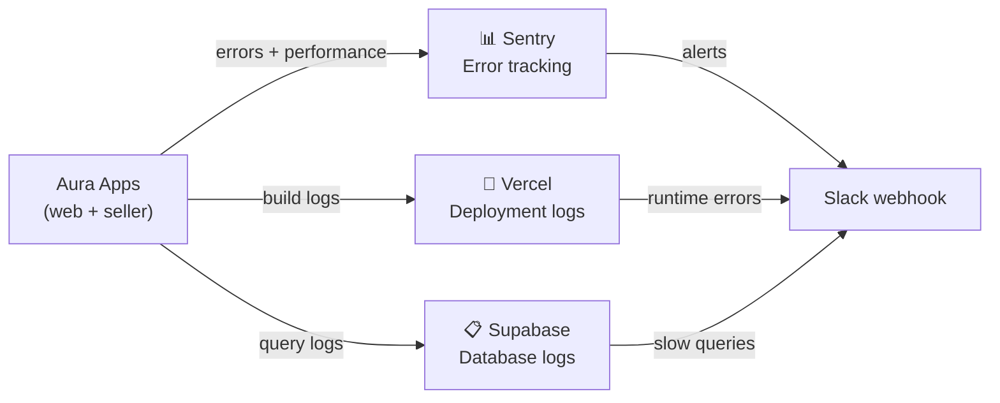

# Aura Marketplace — Architecture & System Design

## System Architecture



## Data Flow — Product Browsing

```mermaid
graph LR
    USER["👤 User"]
    WEB["Buyer App<br/>(TanStack Query)"]
    CACHE["React Query Cache"]
    API["API Route"]
    SUPABASE["Supabase Client"]
    DB["PostgreSQL"]

    USER -->|Click category| WEB
    WEB -->|useQuery| CACHE
    CACHE -->|Cache miss| API
    API -->|select()| SUPABASE
    SUPABASE -->|SQL| DB
    DB -->|product rows| SUPABASE
    SUPABASE -->|JSON| API
    API -->|response| CACHE
    CACHE -->|render| WEB
    WEB -->|display| USER
```

## Authentication Flow



## Order Processing Flow



## Seller Dashboard — Order Fulfillment



## State Management Architecture



## Component Hierarchy — Buyer App



## Database Schema — Key Relationships



## Deployment Pipeline



## Performance Optimization

### Image Optimization
- Next.js `<Image>` component with automatic sizing
- WebP format conversion
- Lazy loading with `loading="lazy"`
- Product images: 400×533px (3:4 aspect ratio)

### Caching Strategy
```
Static:        CSS, JS bundles, fonts → CDN cache (1 year)
ISR (Revalidate): Product catalog → 5 minutes
Dynamic:       User cart, orders → React Query (30s–5m staleTime)
Client:        Search, filters → React state (session)
```

### Bundle Size
- Tailwind CSS 4: tree-shaking unused styles
- Dynamic imports for modals: `React.lazy()`
- Code splitting per route via Next.js App Router

---

## Security Layers



---

## Monitoring & Observability (Optional)



---

**For implementation details, see:**
- `docs/aura-clone-scope-of-work.md` — Full requirements
- `docs/CLAUDE_CODE_PROMPT.md` — Build task order
- `CLAUDE.md` — Development guidance
- `README.md` — Quick start & commands
